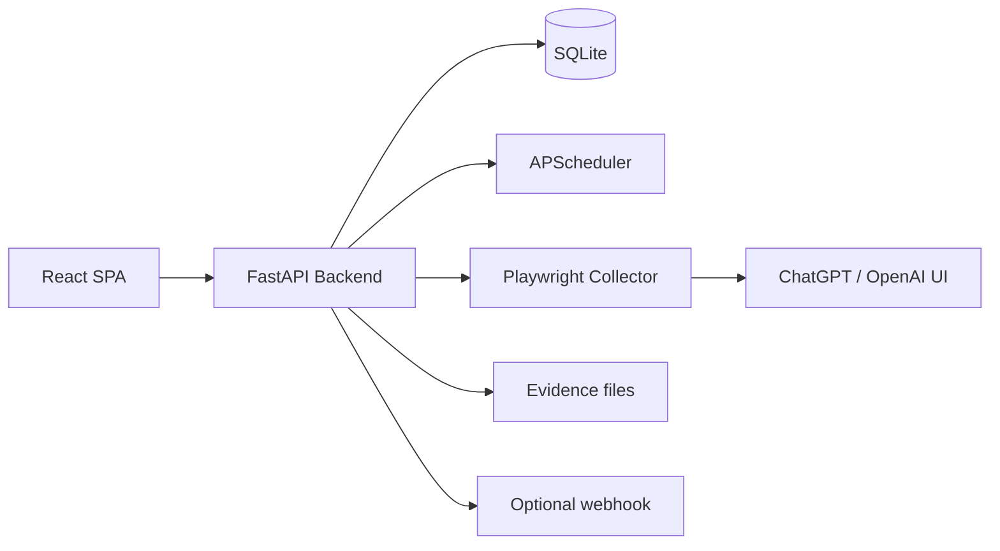

# Техническое задание
## Проект: OpenAI Codex Control Center

## 1. Назначение системы

Система предназначена для локального или приватного self-hosted мониторинга нескольких учетных записей ChatGPT/OpenAI и их рабочих пространств (Personal / Business) с целью контроля:

- состояния авторизации;
- доступных workspaces;
- статусов `active`, `deactivated`, `merged`, `partial_visibility`, `auth_expired`, `unknown`;
- текста лимитов Codex, доступного через UI;
- кредитного баланса, если он виден пользователю;
- истории проверок и evidence-скриншотов.

Система **не** предназначена для распределения нагрузки между аккаунтами, обхода ограничений или автоматической смены аккаунта ради продолжения использования сервиса.

## 2. Цели проекта

1. Дать пользователю единый экран контроля по всем OpenAI-аккаунтам.
2. Исключить ручную проверку каждой учетной записи по отдельности.
3. Хранить историю снимков и диагностические данные.
4. Минимизировать хрупкость решения за счет раздельных модулей сборщика, парсера и normalizer.
5. Не хранить пароли, а работать только через ручной login flow и зашифрованный `storage_state`.

## 3. Границы решения

### 3.1 Что входит в MVP

- хранение аккаунтов;
- запуск ручного входа через Playwright;
- запуск ручного и автоматического сканирования;
- обнаружение workspaces;
- сбор видимого текста из UI;
- эвристический разбор типа workspace, состояния, роли, seat type, плана, limit text, credits;
- хранение истории snapshots;
- сводный dashboard;
- webhook-уведомление о завершении скана;
- runtime-настройки.

### 3.2 Что не входит в MVP

- noVNC/Xvfb удаленная авторизация в браузере;
- прямые интеграции с Telegram/Slack;
- OCR/компьютерное зрение по скриншотам;
- автоматическая калибровка CSS-селекторов из UI;
- экспорт в Excel;
- гибкая RBAC-модель внутри самого дашборда.

## 4. Архитектура

## 5. Основные сущности

### 5.1 Account

Отражает один логин пользователя в OpenAI/ChatGPT.

Поля:
- `id`
- `label`
- `email_hint`
- `notes`
- `is_enabled`
- `auth_state`
- `encrypted_storage_state`
- `last_login_at`
- `last_scan_at`
- `last_status`
- `created_at`
- `updated_at`

### 5.2 BackgroundJob

Универсальная фоновая задача.

Типы:
- `login`
- `scan`

Статусы:
- `pending`
- `running`
- `success`
- `failed`

### 5.3 WorkspaceSnapshot

Снимок найденного workspace в рамках конкретного scan job.

Поля:
- `workspace_name`
- `workspace_kind`
- `workspace_state`
- `role`
- `seat_type`
- `personal_plan`
- `codex_limit_unit`
- `included_limit_text`
- `credits_balance`
- `auto_topup_enabled`
- `spend_limit`
- `source`
- `confidence`
- `raw_payload_json`
- `screenshot_path`
- `checked_at`

### 5.4 AppSetting

Таблица runtime-настроек в формате key-value.

## 6. Функциональные требования

### 6.1 Управление аккаунтами

Система должна позволять:
- создавать аккаунт;
- редактировать аккаунт;
- удалять аккаунт;
- включать/выключать аккаунт из общего мониторинга.

### 6.2 Авторизация

Система должна:
- запускать отдельный login flow через Playwright;
- открывать headed browser;
- ожидать ручного входа пользователя;
- после успешного входа сохранять только `storage_state`;
- шифровать `storage_state` перед сохранением в БД.

### 6.3 Сканирование

Система должна:
- запускать скан для одного аккаунта;
- запускать скан для всех включенных аккаунтов;
- по расписанию создавать фоновые сканы;
- фиксировать ошибки в `BackgroundJob`;
- при истекшей сессии переводить состояние в `auth_expired`.

### 6.4 Обнаружение workspaces

Collector должен:
- пытаться открыть меню профиля/воркспейсов;
- собрать список доступных workspaces;
- различать деактивированные workspaces;
- переключаться между workspaces;
- при неудаче fallback-ить к текущему workspace.

### 6.5 Нормализация данных

Parsers должны уметь извлекать:
- personal plan;
- workspace state;
- workspace kind;
- role;
- seat type;
- limit unit;
- included limit text;
- credit balance;
- auto top-up state.

### 6.6 UI

Интерфейс должен содержать:
- вкладку Dashboard;
- вкладку Accounts;
- вкладку Settings;
- список последних jobs;
- таблицу latest snapshots.

## 7. Нефункциональные требования

### 7.1 Безопасность

- Пароли не хранятся.
- `storage_state` хранится в зашифрованном виде.
- Все данные сохраняются локально.
- Должна быть возможность полностью удалить аккаунт и его данные.

### 7.2 Надежность

- Ошибки скриншота не должны валить scan job целиком.
- Ошибки webhook не должны валить scan job.
- Ошибки одного аккаунта не должны останавливать обработку других аккаунтов.

### 7.3 Поддерживаемость

- CSS-селекторы и keywords должны быть вынесены в отдельные модули.
- Текстовые парсеры должны быть unit-test friendly.
- Модули должны иметь docstring и комментарии.

### 7.4 Производительность

- Для домашнего использования система должна комфортно работать с 5–20 аккаунтами.
- Автоскан должен быть низкочастотным и уважительным.

## 8. Подробный состав модулей

### 8.1 Backend

#### `app/core/config.py`
Единая конфигурация приложения. Отвечает за чтение `.env`, подготовку каталогов и доступ к настройкам.

#### `app/core/logging.py`
Единый формат логов backend.

#### `app/core/security.py`
Шифрование и расшифровка `storage_state` через Fernet.

#### `app/db/base.py`
Базовый класс ORM-моделей.

#### `app/db/session.py`
Создание SQLAlchemy engine, session factory и FastAPI dependency `get_db`.

#### `app/db/models.py`
Все ORM-сущности приложения.

#### `app/schemas/*`
DTO-модели для запросов и ответов API.

#### `app/collectors/parser_rules.py`
Набор keywords для состояний, ролей, seat types, plan types.

#### `app/collectors/parser_helpers.py`
Чистые функции для парсинга текста.

#### `app/collectors/openai_collector.py`
Playwright collector. Именно этот модуль ходит в ChatGPT UI, переключает workspaces, читает текст, делает screenshots и формирует payload.

#### `app/services/account_service.py`
CRUD для аккаунтов.

#### `app/services/job_service.py`
CRUD-операции для фоновых задач.

#### `app/services/login_service.py`
Процесс ручного входа пользователя в аккаунт.

#### `app/services/scan_service.py`
Оркестрация полного scan flow и обновление итогового статуса аккаунта.

#### `app/services/settings_service.py`
Работа с runtime-настройками через таблицу `app_settings`.

#### `app/services/scheduler_service.py`
Автоскан по расписанию.

#### `app/services/evidence_service.py`
Генерация путей до screenshots.

#### `app/services/notification_service.py`
Отправка JSON-событий на webhook.

#### `app/routers/*`
REST API для frontend.

### 8.2 Frontend

#### `src/api/client.ts`
Все HTTP-вызовы к backend.

#### `src/App.tsx`
Главный coordinator frontend, в котором живут state, polling и wiring страниц.

#### `src/components/Layout.tsx`
Каркас интерфейса.

#### `src/components/AccountForm.tsx`
Форма создания и редактирования аккаунта.

#### `src/components/WorkspaceTable.tsx`
Таблица latest snapshots.

#### `src/components/JobBadge.tsx`
Цветной бейдж статуса job.

#### `src/components/StatCard.tsx`
Карточки summary-метрик.

#### `src/pages/DashboardPage.tsx`
Главный дашборд.

#### `src/pages/AccountsPage.tsx`
Управление аккаунтами и деталями выбранного аккаунта.

#### `src/pages/SettingsPage.tsx`
Настройки runtime-параметров.

## 9. Бизнес-правила статусов

### 9.1 Workspace state

- `active` — workspace доступен и collector видит признаки активного UI;
- `deactivated` — workspace заблокирован/серый/locked;
- `merged` — персональный workspace исчез после merge;
- `partial_visibility` — workspace виден, но billing/credits видны не полностью;
- `auth_expired` — storage_state больше не работает;
- `unknown` — информации недостаточно.

### 9.2 Account bucket

- `critical` — есть `deactivated` или `auth_expired`;
- `warning` — есть `partial_visibility`, `merged`, `unknown` или low credits;
- `ok` — все snapshots в рабочем состоянии и без низкого баланса.

## 10. Последовательности работы

### 10.1 Онбординг аккаунта

1. Пользователь создает Account через UI.
2. Нажимает «Начать вход».
3. Backend создает `BackgroundJob(kind=login)`.
4. `LoginService` открывает Playwright browser.
5. Пользователь входит вручную.
6. Backend сохраняет encrypted `storage_state`.
7. Аккаунт переводится в `auth_state=ready`.

### 10.2 Сканирование аккаунта

1. Пользователь нажимает «Сканировать сейчас».
2. Создается `BackgroundJob(kind=scan)`.
3. `ScanService` расшифровывает `storage_state`.
4. `OpenAICollector` собирает список workspaces.
5. Для каждого workspace формируется payload.
6. `ScanService` сохраняет snapshots.
7. Пересчитывается `last_status` аккаунта.
8. UI подхватывает результат polling-ом.

## 11. API endpoints

- `GET /api/health`
- `GET /api/accounts`
- `POST /api/accounts`
- `GET /api/accounts/{account_id}`
- `PUT /api/accounts/{account_id}`
- `DELETE /api/accounts/{account_id}`
- `POST /api/accounts/{account_id}/login/start`
- `POST /api/accounts/{account_id}/scan/start`
- `GET /api/accounts/{account_id}/snapshots`
- `GET /api/jobs`
- `GET /api/jobs/{job_id}`
- `GET /api/dashboard/summary`
- `POST /api/dashboard/scan-all`
- `GET /api/settings`
- `PUT /api/settings`

## 12. Модель данных SQLite

Основные таблицы:
- `accounts`
- `background_jobs`
- `workspace_snapshots`
- `app_settings`

## 13. Риски и допущения

1. UI OpenAI меняется, поэтому selectors/keywords могут потребовать адаптации.
2. Не все роли внутри Business workspace видят billing и credits.
3. При серверном безголовом деплое ручная авторизация сложнее, чем локальный запуск на рабочем месте.
4. Если в UI несколько денежных значений, баланс может потребовать уточняющего parser rule.

## 14. Критерии приемки

Система считается реализованной, если:

1. Создание аккаунта работает.
2. Playwright login flow запускается.
3. После логина encrypted `storage_state` сохраняется.
4. Scan job создает хотя бы один snapshot.
5. Snapshot виден в UI.
6. Dashboard summary показывает aggregated state.
7. История jobs видна в UI.
8. Runtime settings читаются и сохраняются.
9. Unit-тесты parser helpers проходят.
10. README и техническая документация позволяют развернуть проект с нуля.
